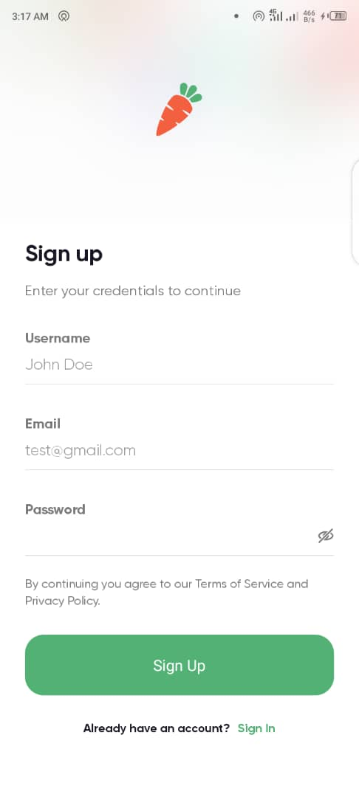
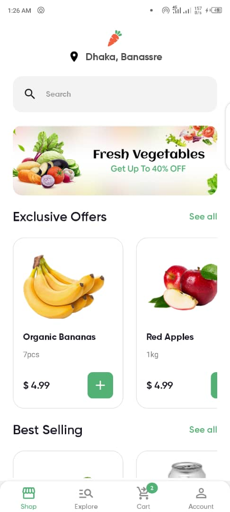
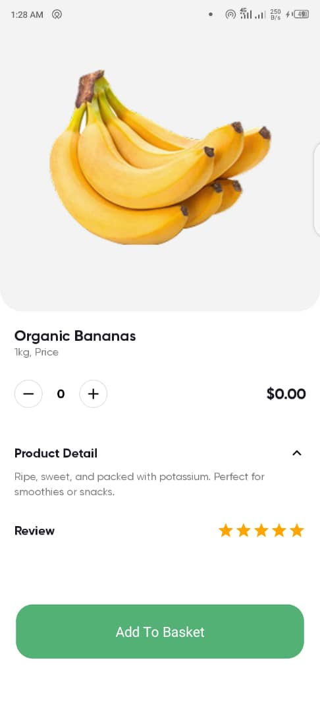
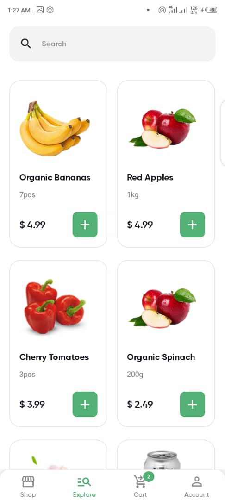
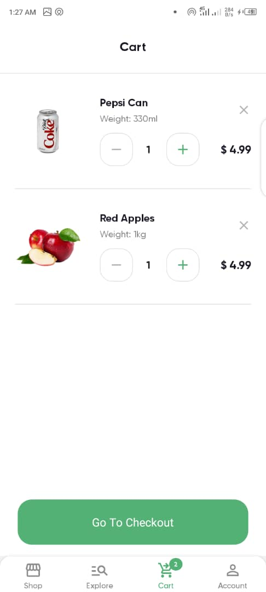
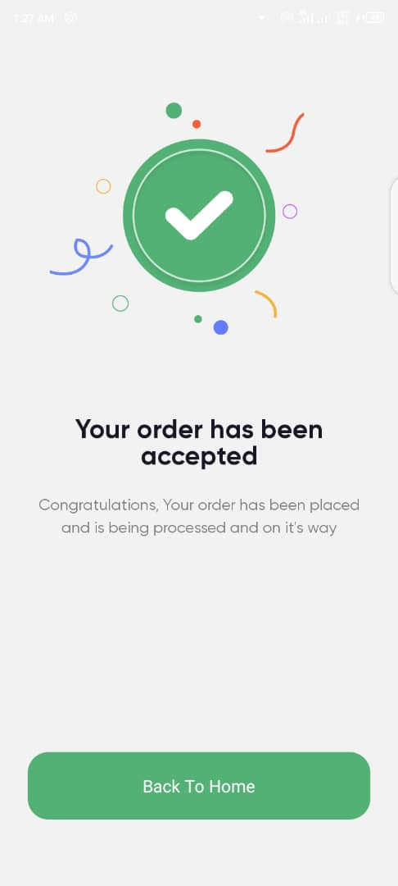
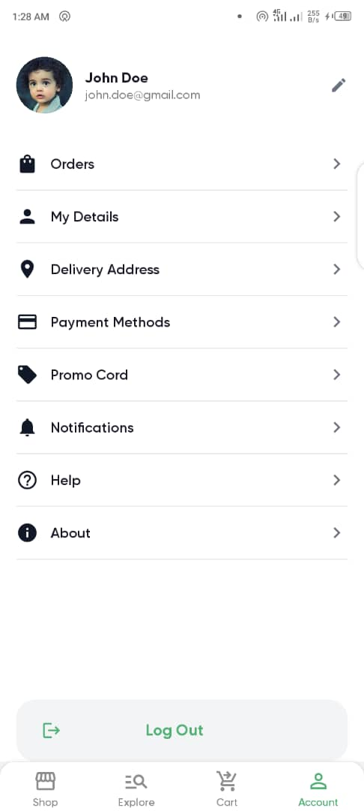

# Nectar Grocery App

A grocery delivery application built with **React Native** and **Expo**. The app allows users to browse through a list of products and includes features such as:

- User authentication with `AsyncStorage`
- Input validation using `react-hook-form`
- Product browsing, cart management, and a mock checkout flow
- A clean and modern interface designed for smooth user experience

This project showcases a blend of thoughtful UI/UX and practical mobile app functionality using modern React Native tooling.

---

## 📲 Preview

### 🔐 Login & Sign Up Screen

Uses **React Hook Form** for validating user inputs with custom rules. Helps reduce boilerplate while maintaining robust validation.

---

### 🛒 Shop Screen

Displayed immediately after a successful sign-in. Shows a scrollable list of available grocery products.

---

### 📦 Product Screen

Displays product details and allows users to add/remove items from the cart.

---

### 🔍 Explore Screen

Helps users navigate and discover available items through a clean UI.

---

### 🧺 Cart Screen

Shows all selected items in the user's cart along with quantity and price information.

---

### ✅ Order Success Screen

Confirms successful order placement and provides the user with relevant details or next steps.

---

### 👤 Account Screen

Provides navigation to additional account management features and menus.

---

## 🎥 App Demo Walkthrough

[▶ Watch App Demo](https://www.capcut.com/s/Ca6uEk3pv2SM4CA5/)

---

## 🧰 Tech Stack

This project was built using:

- **React Native** – for building the mobile UI
- **Expo** – to streamline development and deployment
- **TypeScript** – for type-safe development
- **Zustand** – simple and scalable global state management
- **AsyncStorage** – for local data persistence
- **React Navigation** – for intuitive screen transitions
- **React Hook Form** – for form validation
- **Custom Reusable Components** – for consistent design system

---

## 👨‍💻 About the Developer

Built by Emmanuel Victor Isaac — a passionate full-stack developer focused on frontend experiences with real-world impact.

📬 Contact: **emmanuelvictor.dev@gmail.com**

---
